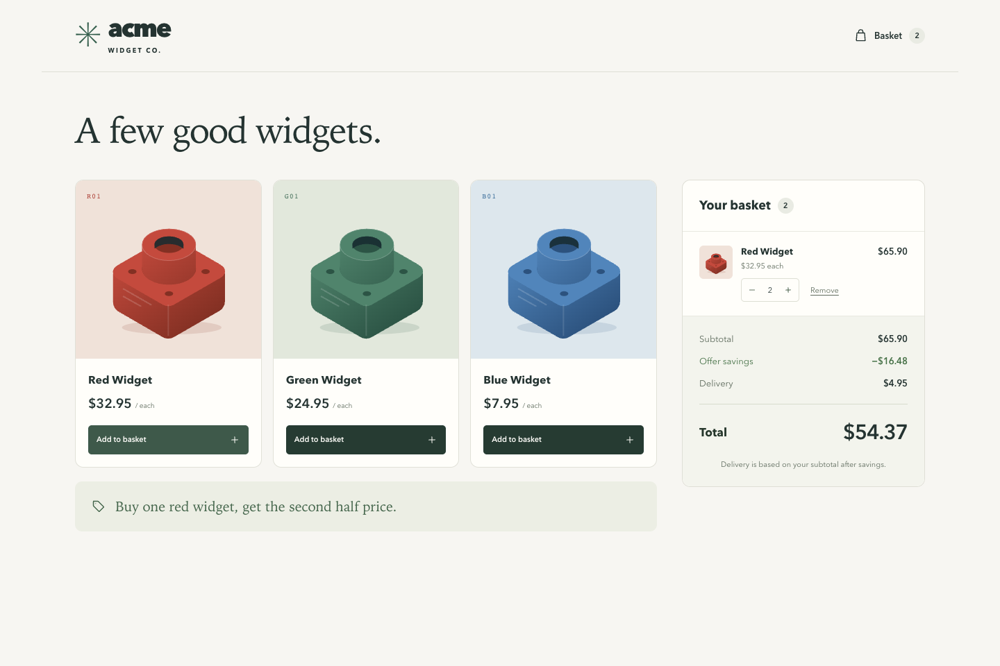

# Acme Widget Co

A working basket quotation app with a small, ordinary-PHP domain, a Laravel API, and a responsive React/TypeScript screen. All four challenge totals match. Docker builds and serves the complete app with one command.



**Start here:** [`Basket.php`](backend/app/Domain/Basket/Basket.php), its [domain types and strategies](backend/app/Domain/Basket), and the [acceptance tests](backend/tests/Unit/Domain/Basket/BasketTest.php). The [design notes](docs/design-notes.md) explain all ten types, the two-red/six-red calculations, and the per-unit rounding policy. [Verification](docs/verification.md) records checks and limits.

## Run

Docker Desktop or Docker Engine with Compose v2 supporting `--wait` is the only application-runtime prerequisite. Initial builds need access to Docker Hub, Packagist, and npm.

```sh
docker compose up --build --wait
```

Open **http://localhost:8080**. Docker installs locked dependencies, compiles React under `/app/`, generates a startup encryption key, caches Laravel configuration, and serves both the API and UI with Apache. No host PHP, Composer, Node, `.env`, key-generation command, database, or second server is needed. Readiness checks the built HTML and Laravel's `/up` route. Only `app` starts by default.

```sh
docker compose ps
docker compose logs -f app
docker compose down
# Rebuild after editing source:
docker compose up --build --wait
# Choose another host port (APP_URL follows it):
APP_PORT=8081 docker compose up --build --wait
```

An optional `APP_KEY` environment variable supplies a fixed Laravel key. Otherwise a fresh valid key is generated at every startup; the quotation app is stateless. The final image has no Node, Composer, development PHP packages, or `.env`.

## Checks

Run from the repository root. Tools use development dependencies in their own images, honor the supplied command, and do not start the app. They copy source during the build; use `--build` after edits.

```sh
docker compose config
docker compose --profile tools run --rm --build backend-tools php artisan test
docker compose --profile tools run --rm --build backend-tools vendor/bin/pint --test
docker compose --profile tools run --rm --build backend-tools vendor/bin/phpstan analyse
docker compose --profile tools run --rm --build frontend-tools npm run typecheck
docker compose --profile tools run --rm --build frontend-tools npm run lint
docker compose --profile tools run --rm --build frontend-tools npm run build
# Pure domain tests, without Laravel boot:
docker compose --profile tools run --rm backend-tools vendor/bin/phpunit --testsuite Unit
# HTTP smoke against the running app, including built assets and error contracts:
docker compose --profile tools run --rm frontend-tools node scripts/smoke.mjs http://app
```

PHPStan runs at level 8 without a baseline. Lint fails on warnings. The PHP suites need no database or migrations. [CI](.github/workflows/ci.yml) builds the tool images, runs these checks, starts the app, exercises HTTP, and stops containers even after failure. [Versions and portability](docs/versions.md) records the pinned official images and lockfiles.

## Model and framework boundaries

`Basket` owns a map of quantities by case-sensitive product code. It receives an immutable `ProductCatalogue`, a `DeliveryPolicy`, and a list of `Offer` strategies. `add(code)` adds one unit; `total(): string` returns an exact two-decimal amount. `breakdown()` produces immutable line snapshots and totals. Repeated calculations preserve state, and an invalid addition leaves the basket unchanged.

Money stores nonnegative integer USD cents, with exact arithmetic and overflow checks. The domain has no Laravel facades, configuration reads, HTTP types, or Eloquent. Here is a direct example using Composer autoloading without booting Laravel:

```php
require 'backend/vendor/autoload.php';

use App\Domain\Basket\{Basket, HalfPriceSecondItemOffer, Money, Product,
    ProductCatalogue, ThresholdDeliveryPolicy};

$catalogue = new ProductCatalogue([
    new Product('R01', 'Red Widget', new Money(3295)),
    new Product('G01', 'Green Widget', new Money(2495)),
    new Product('B01', 'Blue Widget', new Money(795)),
]);
$delivery = new ThresholdDeliveryPolicy([
    ['upperBoundCents' => 5000, 'chargeCents' => 495],
    ['upperBoundCents' => 9000, 'chargeCents' => 295],
    ['upperBoundCents' => null, 'chargeCents' => 0],
]);
$basket = new Basket($catalogue, $delivery, [new HalfPriceSecondItemOffer('R01')]);
$basket->add('R01');
$basket->add('R01');
echo $basket->total(); // "54.37"
```

Laravel supplies primitive [configuration](backend/config/basket.php), [provider bindings](backend/app/Providers/BasketServiceProvider.php), request validation, and JSON serialization. The shared, stateless [`QuoteBasket`](backend/app/Application/QuoteBasket.php) merges duplicate rows and constructs a fresh mutable basket for every quote. No basket is bound as a singleton. No persistence is needed to calculate a quotation.

React keeps quantities locally and asks the API for every monetary breakdown. Cancellation, a request counter, and a key identifying the current basket/attempt prevent old successes or errors from replacing newer quotes. While updating or after an error, amounts are hidden and the status is explicit. The client uses absolute `/api/...` paths on the same origin, with no development proxy.

To extend the model, inject another catalogue, delivery policy, or offer list. Update configuration and its display description together. Offers read prices from line snapshots; they do not look up the catalogue again. The current screen uses color accents for the three challenge products.

## Pricing decisions

| Basket | Total |
| --- | ---: |
| B01, G01 | $37.85 |
| R01, R01 | $54.37 |
| R01, G01 | $60.85 |
| B01, B01, R01, R01, R01 | $98.27 |

Every complete red pair has one full-price $32.95 unit and one $16.47 unit. Half-price is rounded down **per discounted unit**, producing $16.48 savings per pair. An unmatched red remains full price. Eligibility repeats and is independent of insertion order.

Delivery follows the discounted merchandise subtotal: below $50 costs $4.95; $50 to below $90 costs $2.95; $90 or more is free. The two-red example establishes the order: $49.42 merchandise + $4.95 delivery = $54.37. Applying delivery to the $65.90 gross subtotal would give the wrong $52.37 total. Empty baskets have all-zero amounts.

The examples do not uniquely determine rounding beyond one discounted unit:

| Policy | Four R01 | Six R01 |
| --- | ---: | ---: |
| Aggregate discount, half-up | $98.85 | $148.27 |
| **Chosen: each half-price unit rounded down** | **$98.84** | **$148.26** |
| Aggregate discount, half-even | $98.85 | $148.28 |

The tests compare all three using integer arithmetic. Repeating pairs, per-unit rounding, empty-basket behavior, case sensitivity, USD-only pricing, and no taxes are documented assumptions. Prices remain fixed for a basket's lifetime. Independent offer discounts are summed; overlapping-offer priorities and best-offer selection are outside scope. Returns/refunds, persistence, accounts, checkout, payments, inventory, and administration are outside this quotation POC.

## API

`GET /api/catalogue` returns `currency`, a `products` list with `code`, `name`, `unitPriceCents`, and `offerDescription`.

```sh
curl http://localhost:8080/api/catalogue
curl http://localhost:8080/api/basket/quote \
  -H 'Accept: application/json' \
  -H 'Content-Type: application/json' \
  --data '{"items":[{"code":"R01","quantity":2}]}'
```

The two-red response is:

```json
{
  "currency": "USD",
  "items": [{"code": "R01", "name": "Red Widget", "quantity": 2,
             "unitPriceCents": 3295, "lineSubtotalCents": 6590}],
  "subtotalCents": 6590,
  "discountCents": 1648,
  "discountedSubtotalCents": 4942,
  "deliveryCents": 495,
  "totalCents": 5437
}
```

Line subtotals are gross. Savings appear once in the summary; neither serialization nor the frontend recalculates offers.

The JSON root must be an object and `items` an actual array. `items` must be present; `[]` is valid. Each row contains only `code` and `quantity`. Codes must exist in the configured catalogue. Quantities must be actual integers from 1 to 1000; booleans, floats, numeric strings, and missing/zero/negative quantities fail. There is a maximum of 1000 rows and **1000 total units**, including duplicate rows. Duplicate codes are merged before quotation. Extra row fields are rejected; unknown top-level fields, including submitted prices, are ignored.

| Request | Response |
| --- | --- |
| Valid basket, including `{"items":[]}` | 200 JSON quote |
| Malformed JSON syntax | 400 JSON, `message: "Malformed JSON request body."` |
| Invalid fields or JSON containers, including `{"items":{}}` | 422 JSON, Laravel `message`/`errors` |

API errors render as JSON even without an Accept header. Non-JSON form requests reach the same field validation. The browser sends both JSON Content-Type and Accept headers.

## AI assistance

AI assistance was used during implementation and documentation.
